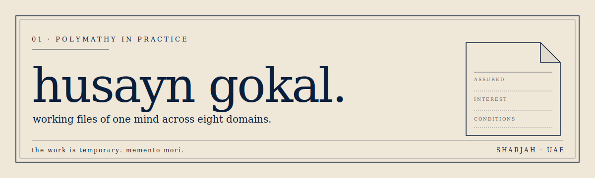

<div align="center">



</div>

<pre align="center">
██╗  ██╗██╗   ██╗███████╗ █████╗ ██╗   ██╗███╗   ██╗     ██████╗  ██████╗ ██╗  ██╗ █████╗ ██╗     
██║  ██║██║   ██║██╔════╝██╔══██╗╚██╗ ██╔╝████╗  ██║    ██╔════╝ ██╔═══██╗██║ ██╔╝██╔══██╗██║     
███████║██║   ██║███████╗███████║ ╚████╔╝ ██╔██╗ ██║    ██║  ███╗██║   ██║█████╔╝ ███████║██║     
██╔══██║██║   ██║╚════██║██╔══██║  ╚██╔╝  ██║╚██╗██║    ██║   ██║██║   ██║██╔═██╗ ██╔══██║██║     
██║  ██║╚██████╔╝███████║██║  ██║   ██║   ██║ ╚████║    ╚██████╔╝╚██████╔╝██║  ██╗██║  ██║███████╗
╚═╝  ╚═╝ ╚═════╝ ╚══════╝╚═╝  ╚═╝   ╚═╝   ╚═╝  ╚═══╝     ╚═════╝  ╚═════╝ ╚═╝  ╚═╝╚═╝  ╚═╝╚══════╝
</pre>

<div align="center">

[](https://husayngokal.com)
[](https://linkedin.com/in/husayn-gokal)
[](mailto:husaynabbasgokal@gmail.com)
[](https://medium.com/@husaynabbasgokal)
[](https://orcid.org/)

<a href="https://komarev.com/ghpvc/?username=husayngokal&label=PROFILE+VIEWS&color=0B1F3D&style=for-the-badge">
  
</a>


<br/>

<a href="https://git.io/typing-svg">
  
</a>

</div>

---

### `01 ·` Currently

<table align="center" width="100%">
  <tr>
    <td width="33%" align="center" valign="top">
      <h4>📖 currently reading</h4>
      <a href="https://husayngokal.com/library/george-orwell-1984">
        <b>1984 — George Orwell</b>
      </a>
      <br/>
      <sub><i>Ralph A. Ranald · 50%</i></sub>
    </td>
    <td width="33%" align="center" valign="top">
      <h4>🔧 currently building</h4>
      <a href="https://husayngokal.com/projects/slipwise">
        <b>Slipwise</b>
      </a>
      <br/>
      <sub><i>AI-native marine underwriting · active today</i></sub>
    </td>
    <td width="33%" align="center" valign="top">
      <h4>📋 currently studying</h4>
      <a href="https://husayngokal.com/study/credentials/ics-marine-insurance">
        <b>ICS Marine Insurance</b>
      </a>
      <br/>
      <sub><i>Institute of Chartered Shipbrokers · exam this week</i></sub>
    </td>
  </tr>
</table>

> *The "currently" row mirrors the hero on [husayngokal.com](https://husayngokal.com). Edit the three cells whenever the work moves.*

---

### `02 ·` Polymathy in practice

> *Working files of one mind across eight domains. What I'm building, reading, writing, and studying; kept visible as the work moves, not waiting for it to be ready. Editorial in form, in-progress in substance.*

<table align="center">
  <tr>
    <td align="center" width="160">🛠️<br/><b>Software & Product</b><br/><sub>TypeScript · React · Postgres</sub></td>
    <td align="center" width="160">🤖<br/><b>AI Engineering</b><br/><sub>RAG · pgvector · BullMQ</sub></td>
    <td align="center" width="160">🧮<br/><b>Mathematics</b><br/><sub>Linear Algebra · Probability</sub></td>
    <td align="center" width="160">⚛️<br/><b>Quantum Computing</b><br/><sub>Qiskit · QGNNs · QML</sub></td>
  </tr>
  <tr>
    <td align="center">🔌<br/><b>EEE</b><br/><sub>ASTI HID · APD optics</sub></td>
    <td align="center">🔐<br/><b>Cybersecurity</b><br/><sub>OWASP ASVS · STRIDE</sub></td>
    <td align="center">💾<br/><b>Low-Level</b><br/><sub>Unix systems · C</sub></td>
    <td align="center">🪶<br/><b>Philosophy</b><br/><sub>Shia fiqh · Arabic linguistics</sub></td>
  </tr>
</table>

---

### `03 ·` Building

<table>
  <tr>
    <td valign="top" width="50%">
      <h4>⚓ <a href="https://slipwise.ai">Slipwise</a></h4>
      <p>AI-native underwriting platform for the Lloyd's coverholder market. PostgreSQL event store, deterministic BullMQ workflow, three-tier context system, pgvector RAG for cross-portfolio pattern matching. SM&CR, EU AI Act, and OFAC sanctions compliant by design.</p>
      <sub><b>Stack:</b> TypeScript · Node · Postgres · BullMQ · Claude API · pgvector</sub>
    </td>
    <td valign="top" width="50%">
      <h4>🐾 PawCare</h4>
      <p>Voice-native veterinary triage capstone. Real-time conversational AI for pet symptom intake and clinic routing.</p>
      <sub><b>Stack:</b> Deepgram Nova 3 · GPT-4.1 Mini · Cartesia Sonic 3 · LiveKit</sub>
    </td>
  </tr>
  <tr>
    <td valign="top" width="50%">
      <h4>💰 <a href="https://github.com/Coders-HQ/Bounty">CodersHQ Bounty</a></h4>
      <p>UI sitting on top of the CodersHQ backend that lets companies post engineering challenges. Participants are ranked by algorithm; the highest-ranked wins the bounty.</p>
      <sub><b>Stack:</b> TypeScript · React</sub>
    </td>
    <td valign="top" width="50%">
      <h4>🧪 <a href="https://github.com/husayngokal/zu-qc-hackathon">Zayed University QC Hackathon</a></h4>
      <p>Quantum computing hackathon teaching material — qubits, circuits, and applied algorithms for university students.</p>
      <sub><b>Stack:</b> Qiskit · Jupyter</sub>
    </td>
  </tr>
</table>

---

### `04 ·` Stack

<div align="center">

**Languages**


**AI · Backend · Data**


**Quantum · Research**


**Tools**


</div>

---

### `05 ·` By the numbers

<div align="center">


</div>

> *The WakaTime card needs a [WakaTime account](https://wakatime.com) and IDE plugin — until then it'll show empty. Remove it or set it up.*

---

### `06 ·` In three dimensions

<div align="center">

<!-- 3D contribution calendar — generated nightly by yoshi389111/github-profile-3d-contrib action -->


<!-- Snake animation — generated by Platane/snk action -->
<picture>
  <source media="(prefers-color-scheme: dark)" srcset="https://raw.githubusercontent.com/husayngokal/husayngokal/output/github-snake-dark.svg" />
  <source media="(prefers-color-scheme: light)" srcset="https://raw.githubusercontent.com/husayngokal/husayngokal/output/github-snake.svg" />
  
</picture>

<!-- Activity graph — live service, no action needed -->


</div>

> *The 3D calendar and snake animation require GitHub Actions to generate them. See [setup notes](#setup-notes) at the bottom.*

---

### `07 ·` Trophies & recognition

<div align="center">


</div>

**Academic & professional**

- 📄 Co-author, *"Quantum Graph Neural Networks for Financial Fraud Detection"* — Springer Nature *Quantum Machine Intelligence* (2024) · [100+ citations]
- ⚛️ **Qiskit Advocate** — IBM Quantum
- 🎤 Speaker — Conf42 · Womanium Quantum
- 📜 **CAPM** — Project Management Institute
- ⚓ **ICS Introduction to Shipping** (May 2026) · **ICS Marine Insurance** in progress
- 🏛️ ASTI Higher International Diploma in Electrical & Electronic Engineering · EduQual Level 5
- 🤝 Former collaborator — quantum optics startup (Tehran) · researchers from Sharif University of Technology and Shahid Beheshti University

**GitHub achievements**


---

### `08 ·` Latest from the notebook

<!-- BLOG-POST-LIST:START -->
*This block is auto-populated by the [blog-post-workflow](https://github.com/gautamkrishnar/blog-post-workflow) GitHub Action from [husayngokal.com](https://husayngokal.com/notebook). Until you wire it up, here are the most recent posts:*

- 📝 [**Why Cities?**](https://husayngokal.com/notebook/why-cities) — *note · 2026-05-17*
- ✒️ [**The AI Usage Constitution**](https://husayngokal.com/notebook/ai-usage-constitution) — *essay · on AI use, well*
- ⚛️ [**Benchmarking Quantum Computers vs Classical Computers**](https://husayngokal.com/notebook/benchmarking-quantum-vs-classical) — *essay · 2024-10-09*
- 🕸️ [**Quantum Complex Networks — A Series**](https://husayngokal.com/notebook/quantum-complex-networks) — *essay · 2024-09-10*
<!-- BLOG-POST-LIST:END -->

[**all posts →**](https://husayngokal.com/notebook)

---

<div align="center">

<br/>

<sub><i>the work is temporary. memento mori.</i></sub>

<br/><br/>

[`husayn@husayngokal.com`](mailto:husayn@husayngokal.com) · [`husaynabbasgokal@gmail.com`](mailto:husaynabbasgokal@gmail.com)

<sub>weekly email when anything changes on the site — <a href="https://husayngokal.com">husayngokal.com</a></sub>

</div>

---

<details>
<summary><b>📐 Setup notes</b> — how to wire up the animated pieces</summary>

<br/>

This README references several GitHub Actions that need to be set up in your `husayngokal/husayngokal` repo. Create `.github/workflows/` and drop in these files:

**1. Snake animation** (`.github/workflows/snake.yml`)

```yaml
name: Generate Snake
on:
  schedule: [{cron: "0 */24 * * *"}]
  workflow_dispatch:
  push: {branches: ["main"]}
jobs:
  generate:
    runs-on: ubuntu-latest
    permissions: {contents: write}
    steps:
      - uses: Platane/snk/svg-only@v3
        with:
          github_user_name: husayngokal
          outputs: |
            dist/github-snake.svg?palette=github-light&color_snake=#0B1F3D&color_dots=#EFE7D7,#d4cab3,#a99573,#0B1F3D,#0B1F3D
            dist/github-snake-dark.svg?palette=github-dark&color_snake=#EFE7D7
      - uses: crazy-max/ghaction-github-pages@v3
        with: {target_branch: output, build_dir: dist}
        env: {GITHUB_TOKEN: "${{ secrets.GITHUB_TOKEN }}"}
```

**2. 3D contribution calendar** (`.github/workflows/3d-contrib.yml`)

```yaml
name: GitHub Profile 3D Contrib
on:
  schedule: [{cron: "0 18 * * *"}]
  workflow_dispatch:
jobs:
  build:
    runs-on: ubuntu-latest
    permissions: {contents: write}
    steps:
      - uses: actions/checkout@v4
      - uses: yoshi389111/github-profile-3d-contrib@0.7.1
        env:
          USERNAME: husayngokal
          SETTING_JSON: assets/setting.json
      - name: Commit
        run: |
          git config user.name github-actions
          git config user.email github-actions@github.com
          git add -A
          git commit -m "generated" || true
          git push
```

**3. Notebook RSS sync** (`.github/workflows/blog-post-workflow.yml`)

```yaml
name: Latest blog post workflow
on:
  schedule: [{cron: '0 */6 * * *'}]
  workflow_dispatch:
jobs:
  update-readme-with-blog:
    runs-on: ubuntu-latest
    steps:
      - uses: actions/checkout@v4
      - uses: gautamkrishnar/blog-post-workflow@v1
        with:
          feed_list: "https://husayngokal.com/rss.xml"
          max_post_count: 5
```

> Confirm your Next.js site exposes RSS at `/rss.xml` or `/feed.xml`. If not, add a feed route and update the URL above.

</details>

<details>
<summary><b>🎨 Theming notes</b> — palette and design tokens</summary>

<br/>

All widgets use the husayngokal.com / Slipwise palette:

| Token | Hex | Use |
|---|---|---|
| Parchment (background) | `#EFE7D7` | widget backgrounds, page tone |
| Navy (primary) | `#0B1F3D` | text, borders, badges, charts |
| Slipwise parchment | `#F2EEE3` | secondary surfaces |

To change palette globally, find-and-replace `EFE7D7` and `0B1F3D` in this file.

The banner SVG (`banner.svg`) is hand-authored — open it and edit the SVG text nodes to change the section number, subtitle, or memento mori line.

</details>
